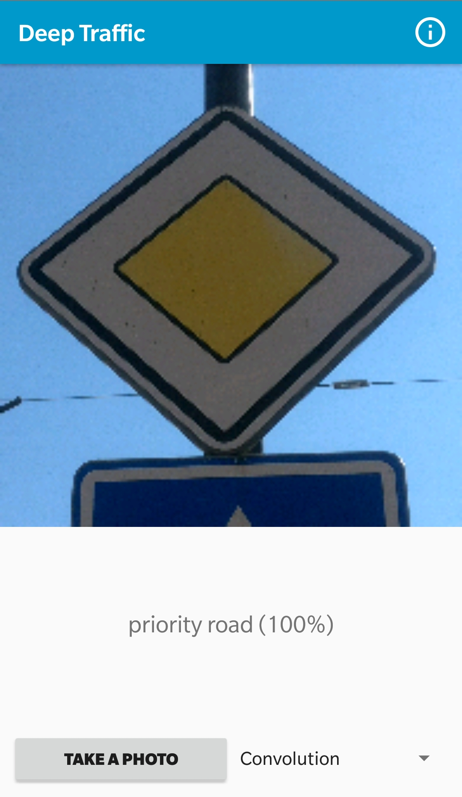

# DeepTraffic Android app
This app is an assignment for a school Advanced Java course. In the first phase of the project several neural networks were trained to recognize traffic signs. This app leverages these models to classify photographs in the real life environment.

  

## Getting started
This repository contains a complete Android Studio project. To try out this app, please clone this directory and open it with Android Studio. Gradle should resolve all the dependencies and build the project.

## How to use
To get started, press the **TAKE A PHOTO** button at the bottom left. That will open your default camera app and let you take a picture. When capturing a photo of a traffic sign, please make sure it covers most of the picture and is centered both horizontaly and verticaly. After confirmation, the photo will be cropped to a square and displayed at the top of the screen. The tensorflow models will classify the photo and the top prediction will be displayed underneath it. You can use the spinner at the bottom right to toggle between models.

### Models
- **Convolution** - network with two convolution + pooling layers and two fully-connected layers
- **Simple** - simple network with three fully-connected layers
- **MobileNetV2** - retrained [Tensorflow Hub module](https://alpha.tfhub.dev/google/imagenet/mobilenet_v2_100_96/feature_vector/2), originally trained on [ImageNet](http://image-net.org/)

### Recognized traffic signs
The models have been trained on the [German Traffic Sign dataset](http://benchmark.ini.rub.de/?section=gtsrb&subsection=dataset) so some of the traffic signs might be different from the ones you encounter. The models can regognize the following categories:
- speed limit 20
- speed limit 30
- speed limit 50
- speed limit 60
- speed limit 70
- speed limit 80
- end of speed limit 80
- speed limit 100
- speed limit 120
- no passing
- no passing by heavy vehicles
- priority road at next intersection
- priority road
- yield
- stop
- no vehicles permitted
- no heavy vehicles permitted
- do not enter
- danger
- left curve
- right curve
- double curves
- bumpy road
- slippery road
- narrow road
- road workers
- semaphore
- pedestrians
- children
- bycicles
- snow or ice
- wild animals
- end of speed limit
- right turn
- left turn
- go straight
- go straight or right turn
- go straight or left turn
- keep right
- keep left
- roundabout
- end of no passing
- end of no passing by heavy vehicles

Most names taken from [here](https://en.wikipedia.org/wiki/Road_signs_in_Germany)
